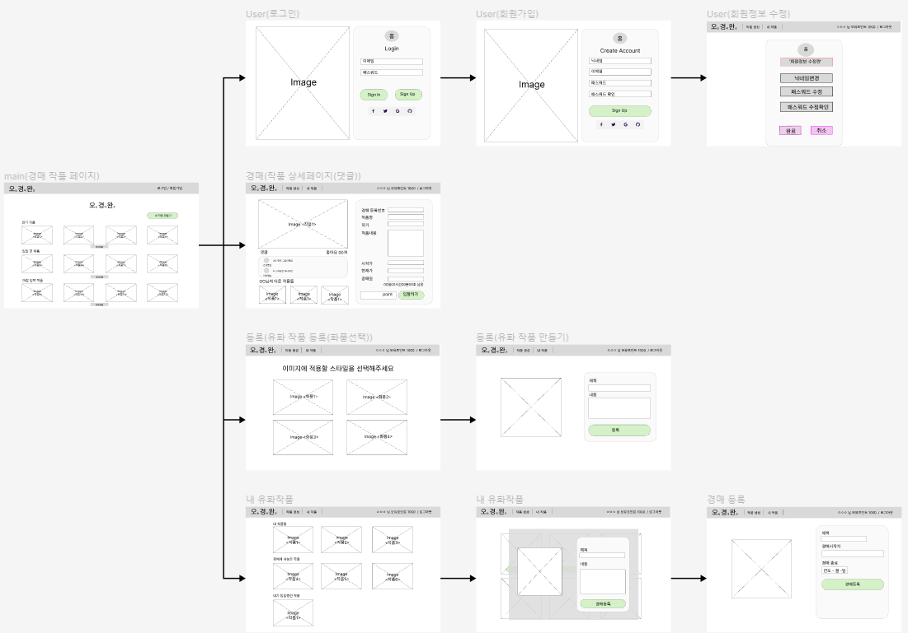
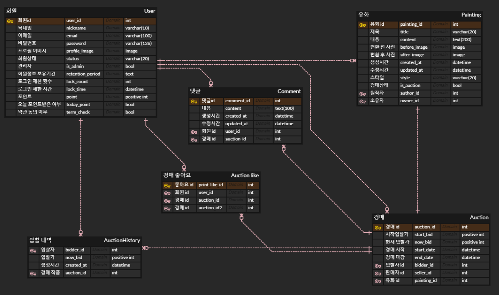
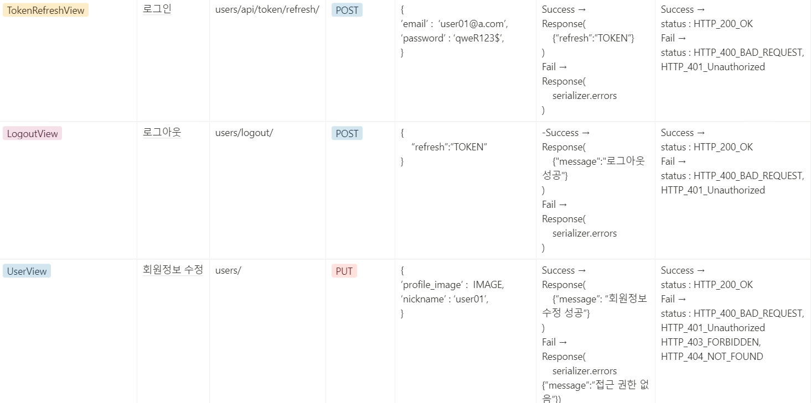
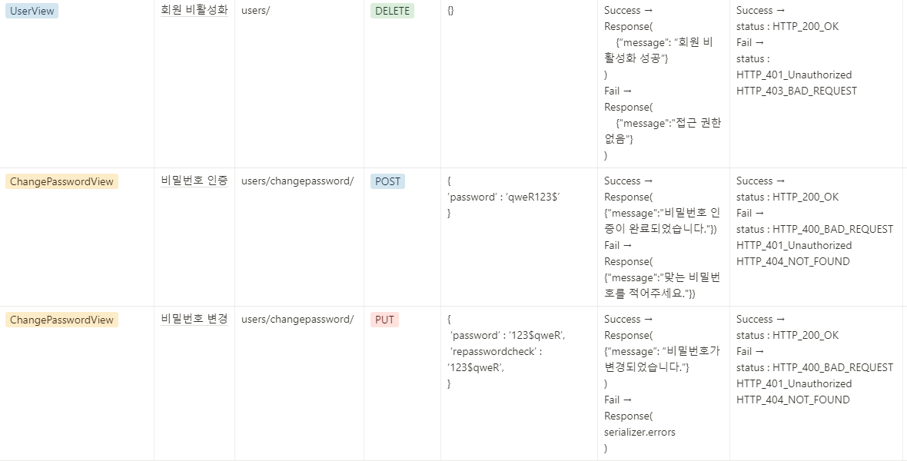
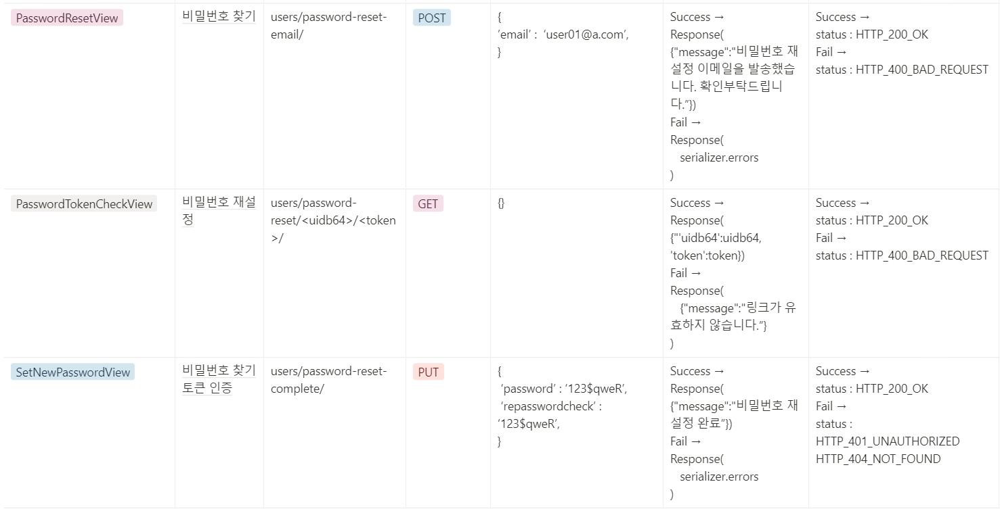
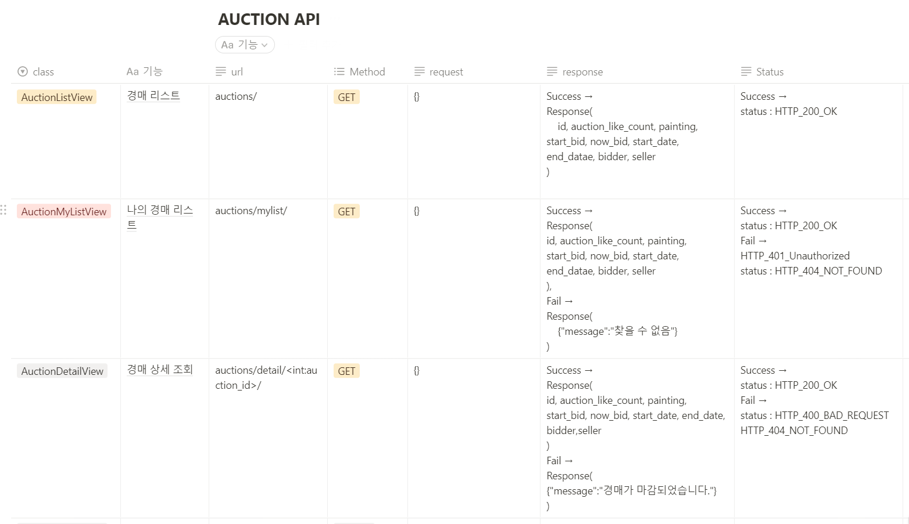
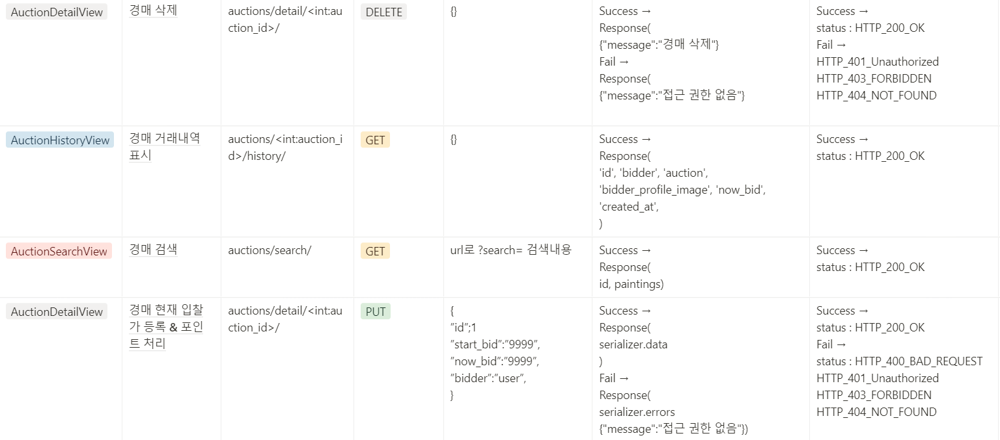
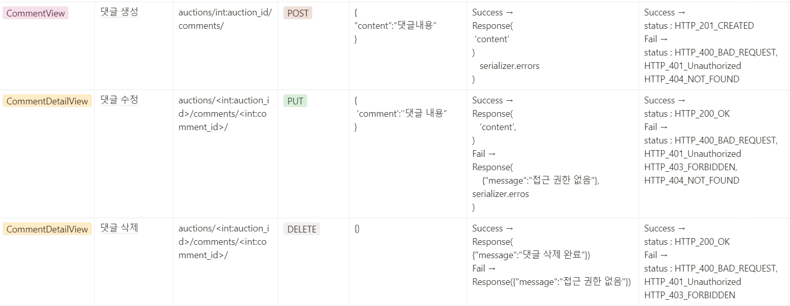

# B7팀(오코완)_유화제작 프로젝트
## [notion](https://bolder-starburst-a73.notion.site/347c2ac124ad442fa5f2f8028a783d1a)

## [Front-end Page](https://github.com/1TEAM12/Oil_Paint_Auction_Front)

## ****📌 프로젝트 핵심 목적****

- Django Restframework와 딥러닝 유화 변경 시스템을 활용하여 경매 웹페이지를 만든다.
- 유저가 원하는 유화 스타일을 적용하여 나만의 유화 작품을 저장하여 관리하는 서비스 제공한다.
- 등록된 작품을 경매로 내놓아 다른 유저들과 작품을 공유하고 경매를 통해 사고 팔 수 있는 플랫폼을 구축한다.

## 📄 ****기능 명세서****

- 사용자 환경(회원가입, 로그인, 회원정보 관리 등)
- 유화 작품 생성, 수정, 삭제 기능 구현(사진 업로드, 유화 스타일 선택/적용 등)
- 나의 유화 작품 경매 등록, 삭제 기능 구현
- 포인트 적립, 사용 기능 구현
- 댓글 생성, 수정, 삭제 기능 구현
- HTML/CSS/Javascript를 활용한 프론트엔드 페이지 구성

## 📘 ****개발 포지션 구성****

- 유저 관리 및 추가 기능
    
    **사재혁**
    
- 내 유화작품 스타일 선택, 생성 및 수정,삭제 기능
    - 유화작품 생성(딥러닝 스타일 적용) 및 등록 : **장진**
    - 유화작품 조회(전체, 상세 페이지), 수정, 삭제 : **손상훈**
    
- 유화 경매 조회 및 생성/삭제 및 상세페이지 기능
    - 경매 생성 : **나웅주**
    - 경매 조회(전체, 상세페이지), 삭제 : 🏆**팀장** **이지영**
    
- 유화 경매 댓글 생성,수정 및 삭제 기능
    
    **장진**
    
- 유화 경매 좋아요, 취소 기능
    
    **나웅주**
    
- 포인트 적립, 사용 기능
    
    **사재혁**
    
- AWS 배포
    
    **ALL**
    
- Front-End
    
    **총괄 : 나웅주**
    

## 💡 ****우리 팀의 약속****

- 각자 하루에 트러블 슈팅 2건 이상씩 작성하기
- 하루 진행 상황을 정리하고 To-do list 체크하기
- Git 컨벤션 지키기  

## ****⚙ 개발환경****  

## back-end :   

​
## front-end :    

## 🕸 ****와이어 프레임****

## 🎯 ****데이터베이스****

## 🎨 ****API 설계****

